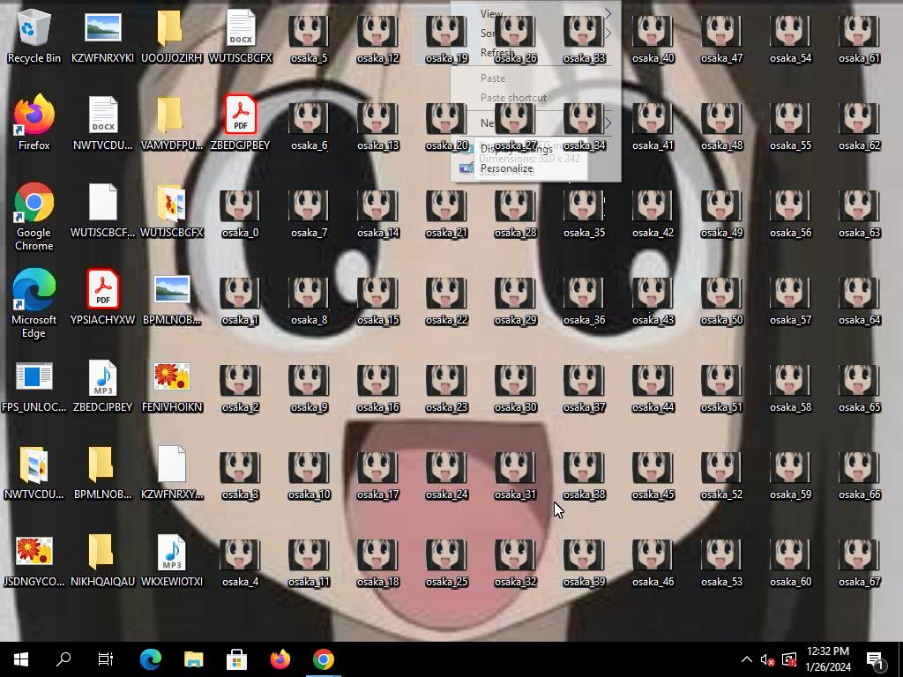

# SataAndagi Malware

this malware copies its own images to the user's desktop, at the same time it plays an annoying audio and after 120 seconds it gives a BSOD.

# Compiling

## linux 
- install mingw compiler and cmake
- create a new folder called build in the same folder of the project 
- enter in that directory and execute: `cmake ..; make`

## windows 
- install cmake and msvc or mingw 
- create a new directory called build
- enter to the directory 
- if you are using msvc execute: `cmake ..; cmake --build .`
- if you are using mingw execute the same as linux

# Config

if you want to change something like the BSOD time see ./src/config.h
